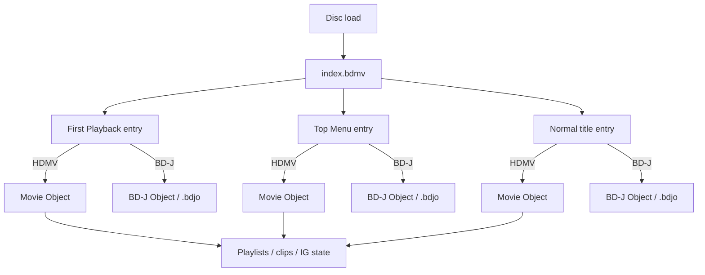

# Public implementation model for HDMV menu authoring

## Executive summary

The public, reconstructable HDMV authoring model is a graph centered on `index.bdmv`, `MovieObject.bdmv`, playlists, clip databases, and transport streams. In the public entity["organization","Blu-ray Disc Association","optical disc standards"] white papers, the index table is the disc’s top-level dispatcher, `MovieObject.bdmv` stores executable HDMV navigation programs, playlists describe play intervals and sub-paths, clip-info files describe the referenced clips, and the `STREAM/*.m2ts` files carry video, audio, presentation graphics, interactive graphics, and TextST elementary streams. Optional HDMV button sounds live in `AUXDATA/sound.bdmv`; TextST fonts live in `AUXDATA/*.otf`; `BACKUP/` mirrors key database files. citeturn45view0turn45view1turn45view2turn45view3turn52view0

Public sources also make the HDMV versus BD-J split very clear. An index entry can point either to an HDMV Movie Object or to a BD-J object; HDMV runs a lightweight navigation-command program and button-command model, while BD-J launches a Java Xlet whose lifecycle is bound to the title. The libbluray public API models this same split with `BLURAY_TITLE::bdj` and `id_ref`, where `id_ref` is a Movie Object number for HDMV titles and a BDJO file number for BD-J titles. citeturn45view0turn11view0turn35view0

For an open-source “HDMV-Lite” target, the most realistic first milestone is not “all of HDMV,” but a conservative subset: HDMV-only dispatch in `index.bdmv`; authored `MovieObject.bdmv`; one or more valid `.mpls` and matching `.clpi` files; static or lightly animated IG pages with BOGs and buttons; neighbor navigation; simple commands such as page changes, title/object jumps, and playlist launches; and optional `sound.bdmv` button sounds. The public sources show that HDMV already supports more than that, including pop-up menus, always-on menus, multi-page navigation, and button enabling/disabling, but those richer behaviors should be a later phase rather than day one. That milestone recommendation is an implementation inference based on the published model, not a normative BDA requirement. citeturn46view2turn46view3turn30view0turn30view2turn34view0turn34view2

## Source base and public-document boundary

The current publicly listed BD-ROM format books still place the normative rules in licensed specification volumes, including BD-ROM Part 3 “Audio Visual Basic Specifications” and Part 2 “File System Specifications.” The freely accessible BDA-era white papers are useful and descriptive, but they explicitly say they were not final at publication time. The practical consequence is important: the broad architecture is publicly reconstructable, but the full normative binary syntax for every field and opcode is not fully documented in the free sources reviewed here. Where a detail is absent from those public sources, this report marks it as not publicly documented rather than filling in gaps. citeturn38view0turn45view0turn45view1

For open implementation work, the most useful public secondary corpus is the tooling around libbluray and menu editors. Public materials from entity["organization","VideoLAN","open source multimedia"] describe libbluray as an open-source Blu-ray library that integrates navigation, playlist parsing, menus, and BD-J, and its public headers and devtools expose a workable model of titles, stream types, first-play/top-menu hooks, playlist parsing, clip parsing, HDMV event logging, and movie-object disassembly. BDedit and DVDLogic IG Editor then fill in the most practical “what authors actually touch” gaps for menu pages, BOGs, button states, command editing, palette handling, and sound references. citeturn8view0turn35view0turn47view0turn29view1turn30view0turn32view0

## File graph and artifacts

The public white paper places all BD-ROM application files under `BDMV/`, with `index.bdmv`, `MovieObject.bdmv`, the `PLAYLIST/`, `CLIPINF/`, and `STREAM/` hierarchies, optional `AUXDATA/` assets, and a `BACKUP/` mirror of key database files. A secondary public structure reference additionally notes the root-level `CERTIFICATE/` folder that some devices expect. The public BDA white papers reviewed here do not assign menu-runtime behavior to `CERTIFICATE/`; in the public-source model, it is structural rather than a logic container. citeturn26view1turn45view1turn44view0

The relationship graph implied by the public sources is:

```mermaid
flowchart TD
    ROOT["Disc root"]
    ROOT --> BDMV["BDMV/"]
    ROOT --> CERT["CERTIFICATE/"]

    BDMV --> INDEX["index.bdmv"]
    BDMV --> MOBJ["MovieObject.bdmv"]
    BDMV --> MPLS["PLAYLIST/*.mpls"]
    BDMV --> CLPI["CLIPINF/*.clpi"]
    BDMV --> M2TS["STREAM/*.m2ts"]
    BDMV --> AUX["AUXDATA/"]
    BDMV --> BACKUP["BACKUP/"]
    BDMV --> BDJO["BDJO/*.bdjo"]
    BDMV --> JAR["JAR/*"]I am putting together a bluray video project with multiple versions of our video project with extras. what free software options are available? I already have a bluray burner


are there any popular github projects?

		
		
		
		
		
		
		
		


what is the best option to get a compatible disk with menus? paid is fine


check out what I built with codex / openclaw: https://github.com/cheeseb1234/auto-bluray-tui feedback & suggestions welcome


what might other menu features be?


if I prompt "add the ability to use HDMV menus as default and toggle optionally to BD-J" what is a possible roadmap to carrying that out?


are there any good knowledge sources on HDMV I can share to it?


Summarize the public implementation model for HDMV menu authoring using BDA format references, libbluray, BDedit, DVDLogic IG Editor, and AuthorScript Video BD.

Identify:
- required BDMV files touched by HDMV menu authoring
- how First Playback and Top Menu are represented
- how HDMV differs from BD-J in index.bdmv/title dispatch
- what MovieObject.bdmv is responsible for
- what IG streams contain: pages, BOGs, buttons, normal/selected/activated states, palettes, commands
- what minimum HDMV-Lite milestone is realistic
- what parts should remain unsupported and fall back to BD-J


for the Open questions and limitations section, is there anything on reddit, stack overflow, github or other sites?

I’ll look for community evidence around the hard parts: HDMV authoring gaps, menu-generation attempts, player compatibility issues, and whether anyone has already built pieces you could reuse.

Yes. I’d add a community-sourced subsection. The pattern is pretty consistent: people want simple Blu-ray menus, but the public/open-source path is thin, tool-specific, and player compatibility is messy.
Open questions and limitations: community evidence addendum
1. No obvious open-source HDMV menu compiler exists

The clearest GitHub signal is tsMuxer issue “Add menu creation to Blu-ray discs”, opened in 2020. The requester specifically wanted “a simple menu” to choose between separate videos on a regular Blu-ray player, and the issue remains open; the repo is also archived/read-only as of April 21, 2025. That is strong evidence that simple Blu-ray menu authoring is a known unsolved gap in the common open-source muxing stack.

Suggested limitation text:

No maintained open-source tool was found that cleanly compiles simple HDMV menus from a high-level model. tsMuxer can author Blu-ray/AVCHD structures, but public project discussion shows menu creation has remained an open feature request rather than a solved capability.

2. Documentation/tutorials are sparse even for people actively trying

A Reddit thread asking for material on coding Blu-ray menus got the answer that there is “some material” but very little, and the discussion later notes that HDMV editing with BDedit may be more approachable than BD-J, but still requires understanding simple instruction-style programming.

VideoHelp reviews say BDedit is powerful but hard to learn; one reviewer says there is not a decent guide and that much of their knowledge came from self-discovery and hints from the Doom9 developer thread. A 2025 VideoHelp thread about rerouting BDedit buttons shows the same problem from a user perspective: BDedit might solve the issue, but the user felt overwhelmed and wanted a tutorial for button routing.

Suggested limitation text:

Community knowledge is fragmented. BDedit appears to be one of the most useful public inspection/editing tools, but users repeatedly report that it is powerful, under-documented, and difficult to learn. Any HDMV backend should treat BDedit as a validation/editor reference, not as a substitute for an internal authoring model.

3. “Works in software” does not prove “works on hardware”

A Stack Overflow case is especially relevant: a user made a Blu-ray with a menu in MultiAVCHD; it tested successfully as a virtual disc and worked in PowerDVD, but on an Xbox One S the menu displayed and played background music while remote/button navigation did not work.

Suggested limitation text:

Software-player validation is insufficient. Community reports show Blu-ray menus may display correctly in PC software while failing remote/button navigation on hardware players. HDMV-Lite should require a compatibility matrix covering at least one PC software player and multiple physical devices.

This is important for your project. A generated ISO passing VLC/PowerDVD/Leawo is not the finish line. BD-RE testing on actual players should be part of the roadmap.
4. BD-J fallback has its own compatibility trap

Several Reddit and issue-tracker posts show the same BD-J pain: VLC/libbluray often detects that a Blu-ray needs Java, but cannot find or use a compatible JVM, then plays without menus.

There are also OS/package-specific reports: Ask Ubuntu answers mention installing libbluray-bdj / libbluray-bin and sometimes pinning a Java version; Red Hat’s Bugzilla had a closed issue for libbluray-bdj being incompatible with Java 17, fixed in later libbluray packaging. A homemade BD-J disc made with Blu-Disc Studio Lite reportedly played in Leawo but initially failed in VLC due to Java/libbluray issues.

Suggested limitation text:

BD-J should remain the advanced fallback, but it is not automatically the compatibility fallback. Public VLC/libbluray reports show recurring JVM detection, packaging, and Java-version problems. A BD-J build may be valid while still failing in VLC depending on the user’s Java/libbluray environment.

5. HDMV may be more compatible, but not necessarily easier to implement

Community comments repeatedly contrast BD-J’s richer behavior with the practical desire for simpler HDMV menus. A Reddit user notes that HDMV editing in BDedit is less fancy than Java but more understandable as simple instructions. At the same time, BDedit/IG Editor-style workflows expose that HDMV still requires button groups, navigation links, command logic, palettes, object states, and playlist integration—not just a background image with clickable rectangles.

Suggested limitation text:

HDMV is a better default target for simple discs, but it should not be treated as “easy mode” internally. It avoids Java, but still requires correct Interactive Graphics streams, button states, navigation references, MovieObject commands, playlist linkage, and player-compatible muxing.

6. UHD/4K Blu-ray is a separate limitation

VideoHelp discussions distinguish normal HD Blu-ray authoring from UHD Blu-ray authoring, noting that many consumer tools can make HD Blu-rays with menus from 4K sources only by downconverting/authoring as HD Blu-ray, while UHD Blu-ray menu authoring is much more limited. tsMuxer’s own issue tracker also shows UHD/Dolby Vision compatibility warnings, including cases where streams are “not standard for BD disks” and may not play in a Blu-ray player.

Suggested limitation text:

HDMV-Lite should initially target standard 1080p Blu-ray BDMV only. UHD Blu-ray, Dolby Vision, HDR menu behavior, BD-50/BD-66/BD-100 assumptions, and UHD-specific compliance should be treated as out of scope until the standard HD Blu-ray path is validated.

I’d add this exact section to the report

## Community evidence and unresolved risks

Public community discussion reinforces that HDMV menu authoring is still a gap in the open-source ecosystem. tsMuxer can create Blu-ray/AVCHD structures, but a long-standing GitHub request for simple menu creation remains open and the repository is archived/read-only. This suggests that “basic menu authoring” should be treated as a real implementation project, not as a small muxer option.

BDedit appears to be one of the most useful public tools for inspecting and editing HDMV structures, but community reports consistently describe it as powerful, under-documented, and difficult to learn. It should be used as a reference and validation aid rather than as the project’s user-facing authoring model.

Player compatibility is another unresolved risk. Community reports show that menus can work in PC software but fail on hardware players, including cases where a Blu-ray menu displays but remote navigation does not work. Therefore, validation should include real BD-RE tests on multiple standalone players, not only ISO playback in software.

BD-J remains useful for advanced menus, but it is not a universal compatibility fallback. VLC/libbluray reports show recurring failures around Java detection, Java version compatibility, missing BD-J classes, and packaging differences. A BD-J disc can be correctly authored yet still fail in VLC depending on the local Java/libbluray setup.

Finally, UHD Blu-ray should stay out of scope for the first HDMV-Lite milestone. Community authoring discussions and tsMuxer compatibility issues show that UHD/HDR/Dolby Vision authoring has separate constraints and should not be mixed into the initial 1080p HDMV menu target.

My recommendation: give OpenClaw these sources and tell it to update the “Open questions and limitations” section with community evidence, but keep the tone cautious. The useful conclusion is not “HDMV is impossible”; it is “HDMV-Lite is worth pursuing, but the project needs its own IR, compiler/validator, and real-player test matrix.”


    BDMV --> META["META/*"]

    INDEX -->|HDMV dispatch| MOBJ
    INDEX -->|BD-J dispatch| BDJO
    MOBJ -->|Play / Jump| MPLS
    MPLS -->|references| CLPI
    MPLS -->|references| M2TS
    CLPI -->|describes| M2TS
    AUX --> SOUND["sound.bdmv"]
    AUX --> FONT["*.otf"]
```

That diagram reflects the BDA white paper’s simplified structure, its directory/file descriptions, and the public editor/tooling documentation around BDJO, clip info, playlists, and sounds. citeturn27view0turn45view1turn29view1turn29view3turn44view0

The key touched paths in an HDMV authoring flow are these:

**`/BDMV/index.bdmv`** stores the top-level title/index information for the BDMV directory. Public sources describe it as the top-level table used whenever a title or menu is executed, and public editors expose First Playback, Top Menu, title search permissions, object type, playback type, and the referenced Movie Object or BDJO target. citeturn45view0turn45view1turn29view1turn29view2

**`/BDMV/MovieObject.bdmv`** stores one or more Movie Objects. In the public model, each Movie Object is an executable HDMV navigation-command program above playlists; commands can start playlist playback or jump to another Movie Object. Public disassembly tooling shows object-level fields such as command count, resume-intention flag, menu-call mask, and title-search mask. citeturn45view0turn45view1turn49view1

**`/BDMV/PLAYLIST/*.mpls`** stores movie playlists. The public white paper defines a Movie PlayList as a collection of play intervals in clips, and the menu/subtitle framework uses sub-paths and sub-playitems to associate secondary presentation paths with the main path. The public `mpls_dump` tool confirms that playlists are a primary validation surface, exposing detailed clip lists, chapter marks, sub paths, PiP metadata, and static metadata. citeturn45view0turn27view1turn51view1

**`/BDMV/CLIPINF/*.clpi`** stores clip information associated with a clip AV stream file. In practice, it is one of the database layers that must stay aligned with authored streams and playlists. Public tool surfaces expose clip info, sequence info, program info, CPI, and extent-start tables, which is exactly the kind of metadata a compiler or packager must keep coherent when authoring HDMV menus onto real clips. citeturn45view1turn29view3turn51view0

**`/BDMV/STREAM/*.m2ts`** stores the BDAV MPEG-2 transport streams used by BD-ROM. Public BDA material lists the supported elementary streams, including video, audio, presentation graphics, interactive graphics, and HDMV Text subtitle streams; libbluray’s public stream-type enum matches that model with `SUB_PG = 0x90`, `SUB_IG = 0x91`, and `SUB_TEXT = 0x92`. citeturn45view2turn35view0

**`/BDMV/AUXDATA/sound.bdmv`** is optional, but if present it stores one or more sounds associated with HDMV Interactive Graphics applications. Public BDA text ties it directly to HDMV IG applications, and public editor help ties individual button selected/activated-state sound references back to `sound.bdmv`. Libbluray’s sample `sound_dump` confirms the expected LPCM-style inspection surface. citeturn45view1turn31view3turn37view0

**`/BDMV/AUXDATA/*.otf`** is touched only if TextST authoring is in scope. The public white paper defines `aaaaa.otf` font files in AUXDATA for text subtitle applications; that makes them part of the public file model, but not required for a static-menu-only HDMV-Lite milestone. citeturn45view1turn45view3

**`/BDMV/BACKUP/*`** contains copies of `index.bdmv`, `MovieObject.bdmv`, all playlist files, and all clip-info files. For a full export/package step intended to look like a complete disc structure, an authoring tool should treat this as part of the emitted filesystem, not an afterthought. citeturn45view1turn44view0

**`/BDMV/BDJO/*.bdjo`**, **`/BDMV/JAR/*`**, and in some workflows **`/BDMV/META/*`** are not needed for an HDMV-only disc, but they are part of the broader public BDMV ecosystem. Public references describe BDJO as the BD-J object target used by index entries and JAR as the Java payload area; a pure HDMV-Lite implementation can and should omit them. citeturn29view1turn44view0

**`/CERTIFICATE/`** should normally be emitted in a finished disc structure even though the public sources reviewed here do not give it HDMV menu semantics. Secondary public references specifically state that some devices expect it for correct playback. citeturn44view0

A minimal HDMV-oriented emitted structure therefore looks like this:

```text
/
  BDMV/
    index.bdmv
    MovieObject.bdmv
    PLAYLIST/
      00000.mpls
    CLIPINF/
      00000.clpi
    STREAM/
      00000.m2ts
    AUXDATA/
      sound.bdmv        # optional
      00000.otf         # only if TextST is authored
    BACKUP/
      index.bdmv
      MovieObject.bdmv
      PLAYLIST/00000.mpls
      CLIPINF/00000.clpi
  CERTIFICATE/
```

That tree is the smallest public-source-consistent “full disc package” for HDMV-only work; a pure intermediate/export package used before final packaging can be narrower. citeturn45view1turn44view0

## Index dispatch and runtime behavior

The public model for First Playback and Top Menu is unusually clear. BDedit exposes First Playback as a special title with title number `0xFFFF` and Top Menu as a special title with title number `0`; it also shows that each index entry carries an object type of HDMV or BD-J, a playback type of Movie or Interactive, and either a Movie Object ID or a BDJO filename. The BDA white paper independently says that when the disc is loaded, the player refers to the First Playback entry to determine the corresponding Movie Object or BD-J Object that shall be executed. citeturn29view1turn29view2turn45view0

The public dispatch difference between HDMV and BD-J is therefore:



That flow is the public-source common denominator across the BDA white paper, BDedit’s index editor, and libbluray’s title model. citeturn45view0turn29view1turn11view0turn35view0

Runtime behavior then diverges. In HDMV, a Movie Object is an executable navigation-command program above playlists. While a playlist is under playback, the state of the Movie Object is maintained and resumes after playlist playback is terminated; button objects are an alternative programming method available while a playlist is playing and can execute by user activation or system timer. In BD-J, selecting a title associated with a BD-J object launches a Java Xlet whose lifecycle is controlled by the application manager and passes through loaded, paused, active, and destroyed states. citeturn45view0turn34view3

A compact practical comparison is:

| Aspect | HDMV | BD-J |
| --- | --- | --- |
| Index dispatch target | Movie Object entry / Movie Object ID | BD-J object / `.bdjo` target |
| Runtime model | Native navigation-command program plus button-command model | Java Xlet application lifecycle |
| Typical open-source authoring target | Good first target for static menus and deterministic navigation | Better reserved for features needing richer program logic |
| Practical dependency footprint | No Java payload required | BDJO/JAR packaging and Java runtime model required |

The table reflects the BDA public white paper, libbluray’s public title structures, and practical public player/tool descriptions of BD-Java. citeturn45view0turn11view0turn35view0turn39search3

## Movie objects and interactive graphics

### MovieObject.bdmv responsibilities and public structure

In the public implementation model, `MovieObject.bdmv` is the HDMV program bank. The BDA white paper says a Movie Object is an executable navigation-command program that enables dynamic scenario description; navigation commands can launch playlist playback or another Movie Object. BDedit’s public overview shows the author-facing view of those programs: object entries, behavior on menu call, command rows, GPR/PSR/immediate operands, `GoTo` jump targets, and “double click on a Play command jumps to the PLAYLIST page.” Public `mobj_dump` output confirms that each object carries a command count, resume-intention flag, menu-call mask, and title-search mask, and that object code can be disassembled line by line. citeturn45view0turn29view1turn29view2turn49view1

That means the public “structure” of a movie object is not mysterious at the conceptual level even if the exact byte-level syntax remains in licensed books: an object is a call target with flags plus a linear command program. In the free public sources reviewed here, the “entry points” into Movie Objects are their object IDs as targeted from `index.bdmv` or from other commands such as `JumpObject` and `CallObject`; control flow inside the object then uses command-line addresses or labels via `GoTo`. Anything more granular than that is not publicly documented in the source set reviewed here. citeturn34view0turn34view1turn34view2turn45view0turn49view1

A public-source-consistent conceptual structure is:

```text
MovieObject.bdmv
  object[0]
    resume_intention_flag
    menu_call_mask
    title_search_mask
    command[0..n]
  object[1]
    ...
```

That abstraction is supported directly by the BDA description and by `mobj_dump`’s public field names and disassembly mode. citeturn45view1turn49view1

### IG stream contents and authoring semantics

Public sources are strongest on the Interactive Graphics side because editor manuals expose the data model directly. The BDA white paper describes HDMV IG as the framework behind pop-up menus, always-on menus, multi-page menus, and button enabling/disabling. DVDLogic IG Editor then names the internal objects explicitly: pages, BOGs, buttons, effects, objects, palettes, and button command source. citeturn46view2turn46view3turn32view3

A **page** is a uniquely identified menu page for the epoch. The public IG Editor help states that page IDs are unique within an interactive composition, valid values are `0x00` through `0xFE`, and the page also defines animation frame rate and per-page background behavior. Public BDA material separately describes multi-page menus with explicit inter-page navigation and seamless page switching via button-activated commands. citeturn32view2turn46view3

A **BOG** is a Button Overlap Group. The public IG Editor help says a BOG defines a group of button structures and that at most one button in a BOG may be in a non-disabled state at any one time. The BOG also carries a default valid button ID reference, and public BDedit documentation exposes the same practical authoring fields: default valid button, button count, insertion/deletion of BOGs, and follow-on button commands such as `SetButtonPage` and `GoTo`. citeturn31view1turn33view0turn30view0

A **button** carries numeric selection value, auto-action flag, coordinates, neighbor links, and object/sound references for each visible state. Public IG Editor help states that button IDs are unique within a page, overlap is only allowed for buttons within the same BOG, and the `Upper/Lower/Left/Right Button Id Ref` fields define where selection moves when directional user operations occur. BDedit exposes the corresponding authoring labels directly: `upper`, `button_numeric_select_value`, `auto_action_flag`, positions, and the normal/selected/activated start references. citeturn33view0turn33view1turn30view0

The three core button states are **normal**, **selected**, and **activated**. Public IG Editor help describes each state using a start and end object ID reference and a repeat flag. If start and end are equal, one object is presented; if they differ, the player presents the object sequence using the page animation frame rate. For selected and activated states, optional sound references point back to `sound.bdmv`; if the sound ID is `0xFF`, no sound is associated. The same help also states that all referenced state objects must exist and must share the same dimensions. citeturn33view2turn33view3turn31view3

**Palettes** and **objects** are the bitmap side of the IG system. The public white paper describes graphics streams as using an 8-bit index lookup table with 24-bit color plus 8-bit alpha and supporting fade/color-change style effects. Public BDedit and IG Editor docs show author-facing palette recalculation, transparency inspection, object import, and palette/object associations. The full binary object coding is not publicly documented in the sources reviewed here, but the public authoring semantics are sufficiently explicit for an HDMV-Lite data model. citeturn45view3turn31view2turn30view0

**Button command syntax and semantics** are also public enough to be useful. The white paper says HDMV navigation commands are grouped into playback, comparison, and arithmetic/bitwise operations, and that those commands manage playlist playback, execution of Movie Objects and Titles, and control of the graphics display, including button enabling/disabling. Public IG Editor help then exposes a concrete author syntax: GPRs are written as `[n]`, PSRs as `{n}`, constants as bare numbers, and example commands include `Nop`, `GoTo`, `JumpObject`, `JumpTitle`, and `CallObject`. BDedit’s emulator exposes the same practical model and explicitly follows `SetButtonPage`, `GoTo`, `Jump Title`, and playlist-related commands. citeturn46view3turn34view0turn34view1turn34view2turn30view0turn28view3

## HDMV-Lite milestone and fallback boundary

A realistic **HDMV-Lite** milestone, inferred from the public model above, is a deliverable that proves a complete HDMV-only path from disc load to menu navigation without attempting the full BDA surface area. In practical terms, it should compile a valid HDMV title/top-menu path, static or lightly animated IG pages, and basic navigation commands, while deliberately leaving richer app-like experiences to BD-J or to a later native-HDMV phase. That scoping recommendation follows from the public evidence that HDMV already supports pop-up, always-on, multi-page, and dynamic button behaviors, while BD-J is the standard’s richer Java application environment. citeturn46view2turn46view3turn45view0turn39search3

Concrete acceptance criteria for such a milestone could be:

- **Disc package correctness:** emit `BDMV/` with `index.bdmv`, `MovieObject.bdmv`, at least one `.mpls`, matching `.clpi`, referenced `.m2ts`, and optional `AUXDATA/sound.bdmv`; emit `BACKUP/` mirrors when producing a full disc image/package. citeturn45view1turn44view0
- **HDMV-only dispatch:** `index.bdmv` contains an HDMV First Playback entry and an HDMV Top Menu entry, both pointing to Movie Objects rather than BDJO files. citeturn29view1turn29view2turn45view0
- **Static-page navigation:** support multiple pages, BOGs, button rectangles/positions, directional neighbors, numeric select value, and page changes invoked by button commands. citeturn33view0turn33view1turn46view3
- **Simple state rendering:** for each button, support one static object per normal/selected/activated state, with optional short fixed-sequence animation later; support optional button sounds through `sound.bdmv`. citeturn33view2turn33view3turn31view3
- **Restricted command set:** at minimum support `Nop`, `GoTo`, `JumpObject`, `JumpTitle`, `CallObject`, playlist-launch/playback commands, and the page/button-display controls needed for simple menu flow. citeturn34view0turn34view1turn34view2turn46view3
- **Validation surface:** output opens cleanly in BDedit’s menu emulator, disassembles with `mobj_dump -d`, parses with `index_dump`, `mpls_dump`, and `clpi_dump`, and produces relevant playback/menu events under `hdmv_test`. citeturn29view0turn49view1turn36view0turn51view0turn51view1turn50view0

For a first open-source implementation, these advanced features should remain unsupported or explicitly routed to BD-J or a later phase:

- **Motion-heavy compositions and complex timeline animation.** Public HDMV docs show that HDMV can do more than a static menu, but the authoring and validation surface expands quickly once you rely on animated object sequences, button enable/disable choreography, and multiplexed on-video menu timing. For HDMV-Lite, treat those as later native-HDMV work, not baseline. citeturn46view2turn46view3turn33view2turn33view3
- **Quiz/game/app-style interactivity.** Public consumer documentation describes BD-Java discs as enabling games and interactive menus, and the BDA white paper models BD-J as a full Java Xlet application with a managed lifecycle. Those are good signals that heavily stateful or app-like experiences belong on the BD-J side of the boundary. citeturn45view0turn39search3
- **Java applets, complex dynamic logic, and rich persistent app state.** That is squarely in the Java/Xlet model rather than the limited HDMV command VM exposed in the public toolchain. citeturn45view0turn34view3
- **TextST authoring as a baseline requirement.** Public docs clearly support TextST and related fonts/sub-path behavior, but that should be optional after static menu navigation works. citeturn27view1turn45view3

## Validation, compatibility, and implementation next steps

A short compatibility checklist for an HDMV-only disc is:

- Burn/package the image as a Blu-ray filesystem layout with `BDMV/` and `CERTIFICATE/`; the public file-system white paper and practical disc-structure references align on UDF 2.5-era Blu-ray structure, and some devices expect `CERTIFICATE/`. citeturn52view0turn44view0
- Ensure every `index.bdmv` target resolves to a real HDMV Movie Object, and every Movie Object play/jump target resolves to real playlists or objects. citeturn29view1turn45view0turn49view1
- Keep `.mpls`, `.clpi`, and `.m2ts` aligned whenever you add or alter IG/TextST streams or sub-paths. Public tooling treats playlist and clip-info coherence as a primary validation target. citeturn27view1turn29view3turn51view0turn51view1
- Respect IG invariants: page-scoped unique button IDs, overlap only inside a BOG, valid neighbor references, and same-sized object chains for state sequences. citeturn33view0turn33view1turn33view3
- Do not emit BDJO/JAR payloads at all for a pure HDMV-Lite target. If you need them, that is already a BD-J build path. citeturn29view1turn44view0

The public libbluray tools are strong validation anchors:

- `index_dump <disc_root>`: the public sample shows this usage and prints First Playback, Top Menu, title count, object type, playback type, and target references. citeturn36view0
- `mobj_dump -d BDMV/MovieObject.bdmv`: the public tool usage is `usage: %s [-d] <file>`, and `-d` disassembles object code while also printing flags and command counts. citeturn49view1
- `mpls_dump -i -c -p BDMV/PLAYLIST/00000.mpls`: the public usage text shows detailed playlist info, chapter marks, and sub paths. citeturn51view1
- `clpi_dump -c -p -i BDMV/CLIPINF/00000.clpi`: the public usage text shows clip info, program info, CPI, and related structures. citeturn51view0
- `hdmv_test [-v] [-t <title>] <media_path> [<keyfile_path>]`: the public tool usage is explicit, and the source shows it logging title, playlist, chapter, popup, menu, IG stream, overlay, and sound-effect related events while running first play and optional title playback. citeturn50view0
- `sound_dump`: the public examples include a sound inspection tool for the menu sound asset path. citeturn22view0turn36view1

The editor-side validators are also valuable. BDedit publicly exposes menu viewing, editing, loading/saving IG data, emulation of movie-object and button commands, and tracing of `SetButtonPage`, `GoTo`, title jumps, and playlist-related flow. DVDLogic IG Editor publicly exposes syntax-highlighted navigation command editing, menu checking, and an export path to IES or Scenarist-oriented project representations. Those capabilities make both tools useful as external oracle implementations even if you never depend on their file formats in production. citeturn29view0turn30view0turn32view0turn32view3

For an open-source authoring project, the best next implementation steps are:

**Define a neutral IR first.** The IR should model index entries, movie objects, playlists/playitems/subpaths, clip references, and an IG tree of display set → pages → BOGs → buttons → object/palette/sound references. Public tools and white papers are already aligned on that conceptual graph, so keeping it explicit will make backend swapping easier. citeturn45view0turn45view1turn32view3turn33view0

**Separate “export package” from “full compiler.”** A practical first backend can emit a human-reviewable package: JSON/XML or another internal schema, plus button PNGs, optional WAV assets for eventual `sound.bdmv`, command source, and mapping files for playlists/clips. A later backend can compile that IR into real `index.bdmv`, `MovieObject.bdmv`, playlist/clip-info files, and IG assets. This mirrors the way public tools expose editable author data separately from muxing/packaging steps. citeturn28view1turn29view0turn32view3

**Treat BD-J as a separate backend, not a mode flag inside HDMV-Lite.** The public model says the dispatch target, runtime, and asset payloads are genuinely different. A clean architecture therefore wants one frontend/menu IR, an HDMV backend, and a BD-J backend, rather than a single emitter with many conditional branches. citeturn45view0turn11view0turn35view0

## Open questions and limitations

The biggest limitation is public documentation depth. The current BD-ROM Part 3 and Part 2 books are listed publicly, but the fully normative syntax lives in licensed specification volumes, while the freely accessible BDA white papers are older and explicitly non-final. Exact bitfield layouts, complete opcode semantics, and some low-level compiler rules are therefore not fully publicly documented in the free sources reviewed here. citeturn38view0turn45view0turn45view1

I also did not retrieve a stable public manual for `AuthorScript Video BD` from entity["company","Roxio","software company"] in the accessible source set used for this report, so I have intentionally not attributed any binary-format behavior or packaging detail to that product. If you have a public AuthorScript manual or SDK document, it would be worth using as a cross-check against the MovieObject/playlist/IG packaging assumptions summarized here.

## Community evidence and unresolved risks

Public community discussion reinforces that HDMV menu authoring is still a gap in the open-source ecosystem. tsMuxer can create Blu-ray/AVCHD structures, but a long-standing GitHub request for simple menu creation remains open and the repository is archived/read-only. This suggests that “basic menu authoring” should be treated as a real implementation project, not as a small muxer option.

BDedit appears to be one of the most useful public tools for inspecting and editing HDMV structures, but community reports consistently describe it as powerful, under-documented, and difficult to learn. It should be used as a reference and validation aid rather than as the project’s user-facing authoring model.

Player compatibility is another unresolved risk. Community reports show that menus can work in PC software but fail on hardware players, including cases where a Blu-ray menu displays but remote navigation does not work. Therefore, validation should include real BD-RE tests on multiple standalone players, not only ISO playback in software.

BD-J remains useful for advanced menus, but it is not a universal compatibility fallback. VLC/libbluray reports show recurring failures around Java detection, Java version compatibility, missing BD-J classes, and packaging differences. A BD-J disc can be correctly authored yet still fail in VLC depending on the local Java/libbluray setup.

Finally, UHD Blu-ray should stay out of scope for the first HDMV-Lite milestone. Community authoring discussions and tsMuxer compatibility issues show that UHD/HDR/Dolby Vision authoring has separate constraints and should not be mixed into the initial 1080p HDMV menu target.
