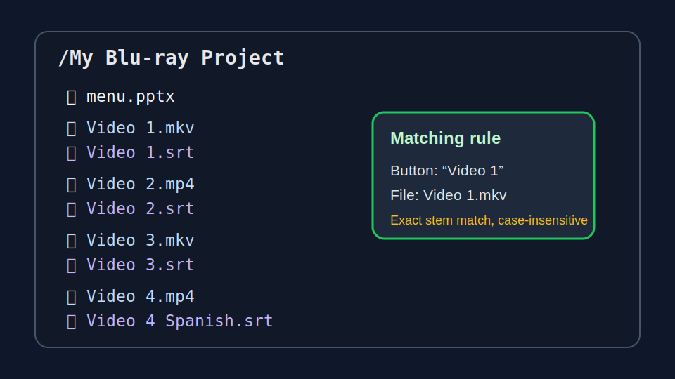
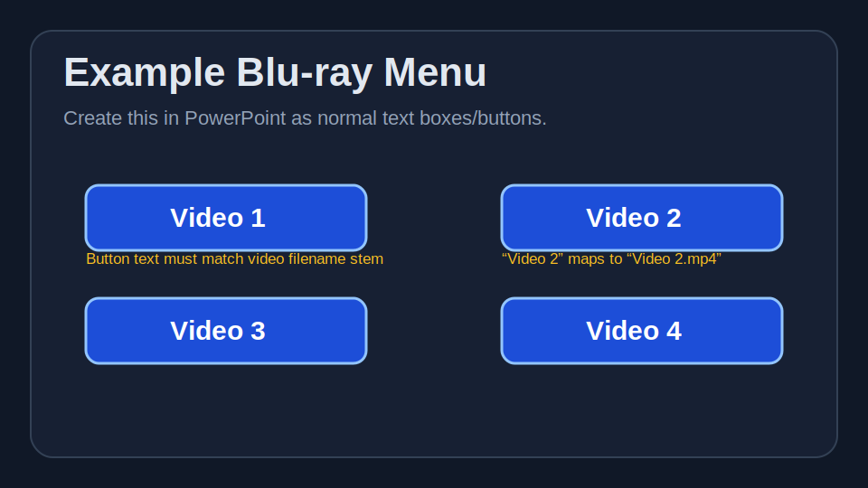
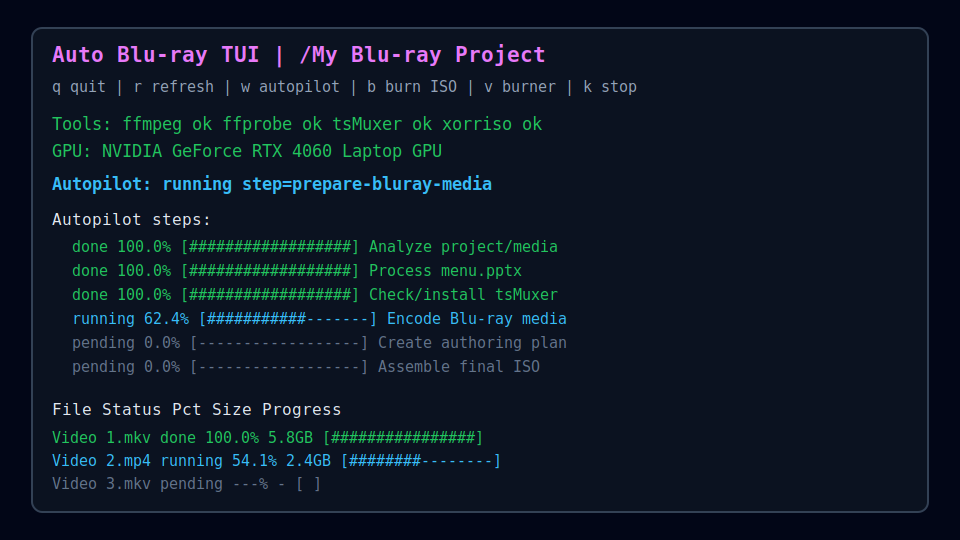
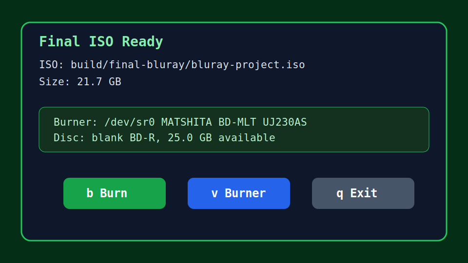

# Auto Blu-ray TUI Walkthrough

This walkthrough shows a typical Auto Blu-ray TUI project from source files to final ISO or burned disc.

## 1. Create a project folder

Put the PowerPoint menu, videos, and optional subtitles in one folder.



Example:

```text
My Blu-ray Project/
├── menu.pptx
├── Feature Film.mkv
├── Feature Film.srt
├── Bonus Feature.mp4
├── Background 1.mp4
└── Background 2.mp4
```

Auto Blu-ray TUI writes generated files into `build/` inside this same project folder. Your original media files are not moved.

## 2. Build the menu in PowerPoint

Design `menu.pptx` visually. The converter uses visible text and slide hyperlinks to decide what should happen.

### Video buttons

A PowerPoint text box/button becomes a video button when its visible text matches a video filename stem. Matching is case-insensitive and also tolerates safe punctuation/metadata differences.

| PowerPoint text | Matches video file | Notes |
| --- | --- | --- |
| `Feature Film` | `Feature Film.mkv` | Exact stem match |
| `Just Friends` | `Just.Friends.2005.720p.mp4` | Safe partial/fuzzy match |
| `Bonus Feature` | `Bonus Feature.mp4` | Exact stem match |
| `Play Movie | Feature Film` | `Feature Film.mkv` | Clean display text with explicit action target |

Supported source video extensions:

```text
.mkv .mp4 .m2ts .mov
```

Generated video mappings are written to:

```text
xlets/grin_samples/Scripts/PptxMenu/video-actions.json
```

The same video can appear on multiple slides; it reuses the same playlist/title ID.

### Clean button text with action grammar

Use the preferred pipe syntax when the button should say something nicer than the filename:

```text
Button Text | Action
```

Examples:

```text
Play Movie | Feature Film
Start at Big Reveal | Feature Film@1:00:30
Watch the Finale | Feature Film#Finale
Chapter 4 | Feature Film#4
Trailer | file:Feature Film Final Export.mov
Bonus Features | goto:Extras
Return to Main Menu | main
Watch Everything | play all
Coming Soon | disabled
```

This is useful when the project has messy source names such as `Feature Film Final Export v7.mov`, but the menu should simply say `Play Movie`.

Common mistakes:

- **Missing video file:** `Play Movie | Main Feature` must resolve to one source video in the project folder.
- **Ambiguous video names:** if `Main Feature Theatrical.mp4` and `Main Feature Extended.mp4` both exist, use `file:Exact Filename.ext` or a more specific action.
- **Empty action after pipe:** `Play Movie | ` is treated as disabled and emits a parse warning.
- **Unsupported commands:** Grammar v1 is intentionally small; slideshow, idle/attract mode, compare cuts, aliases, and project.json routing are future work.
- **HDMV-Lite expectations:** BD-J is the working backend. HDMV-Lite still exports/scaffolds metadata and may mark timestamp/chapter/resume-style actions as future work or BD-J-required.

### Slide navigation buttons

PowerPoint hyperlinks to other slides are preserved as menu navigation buttons. For example, a `Next` button linked to slide 2 stays a slide navigation button.

### Autoplay looped slide video

To add motion to a menu slide, place a shape/text box where the video should appear and set its text to match a project video.

Names like these are treated as loop placeholders instead of clickable movie buttons:

```text
Background 1
Background 2
Preview Loop
Autoplay Intro
```

The converter composites each slide into a generated loop source under:

```text
build/pptx-menu-loops/
```

Loop videos play as the bottom layer. Buttons that overlap the loop are restored as separate normal-state graphics above the video, so the moving background does not cover menu controls.



## 3. Install dependencies

From the repository root:

```bash
./scripts/install-bluray-deps.sh
```

Check-only mode:

```bash
./scripts/install-bluray-deps.sh --check-only
```

The installer checks common dependencies such as ffmpeg, LibreOffice, Poppler, Ant/Java, xorriso, and tsMuxer.

## 4. Launch the TUI

```bash
./scripts/monitor-bluray-project.sh "/path/to/My Blu-ray Project"
```

When the TUI opens, it runs an initial project/media analysis so the dashboard immediately shows the current inventory and preflight notes.

Main controls:

```text
w      full autopilot: subtitles -> analyze -> menu -> encode -> ISO -> burn
Enter  encode media only
b      burn final ISO
r      refresh/re-analyze if project inputs changed
v      cycle detected optical burner
k      stop running encode/autopilot/burn
q      quit

d      disc size: DVD-5 -> DVD-9 -> BD-25 -> quality/no cap
m      menu backend: bdj working default -> hdmv experimental scaffold -> auto
e      encoder: auto -> nvenc -> cpu
z      resolution
l      quality
p      NVENC preset
a      AC-3 audio bitrate
o      only one video / all videos
s      smoke-test length
```

## 5. Start autopilot

Press `w`.

The TUI works through these steps:

1. fetch missing subtitles from OpenSubtitles when credentials are available
2. analyze project/media and refresh the manifest
3. process `menu.pptx`
4. check/install tsMuxer
5. encode Blu-ray media
6. create the authoring/playlist plan
7. build the BD-J menu overlay
8. assemble the final ISO
9. auto-burn the first disc if a suitable blank disc is detected



## 6. Disc size choices

Use `d` in the TUI to cycle the disc target:

| Target | Typical use | Behavior |
| --- | --- | --- |
| `DVD-5` | small AVCHD-style image | lower video bitrate, 192k AC-3 |
| `DVD-9` | dual-layer DVD-sized image | medium bitrate, 256k AC-3 |
| `BD-25` | common single-layer Blu-ray | Blu-ray-sized bitrate, 448k AC-3 |
| `quality/no cap` | larger discs/testing | CRF/CQ quality mode without size target |

The final ISO is size-checked against the selected target unless `--allow-oversized` is used from the CLI.

## 7. Subtitles

Sidecar subtitles are detected when named like the video:

```text
Feature Film.mkv
Feature Film.srt
Feature Film Spanish.srt
```

If sidecars are missing, autopilot can try OpenSubtitles before media analysis. Set:

```bash
export OPENSUBTITLES_API_KEY='your-api-key'
export OPENSUBTITLES_USERNAME='your-username'
export OPENSUBTITLES_PASSWORD='your-password'
export OPENSUBTITLES_LANGUAGE='en'   # optional
```

Without credentials, lookup is skipped safely and the TUI shows an informational note.

## 8. Final outputs

When successful, the project folder contains:

```text
build/bluray-media/        encoded video, logs, manifests
build/bluray-authoring/    playlist maps and mux plans
build/final-bluray/        final BDMV tree and ISO
build/bluray-burn/         burn logs/state
```

Final ISO:

```text
build/final-bluray/bluray-project.iso
```

## 9. Burn the disc

If a blank disc is inserted and large enough, autopilot burns the first disc automatically.

Manual repeat burns:

1. insert a blank BD-R/BD-RE or suitable target media
2. press `v` if you need to choose a different burner
3. press `b` to burn
4. when it ejects, insert another blank disc and press `b` again, or press `q` to exit



## Troubleshooting naming/menu problems

If a PowerPoint video button does not work, check these first:

- Does the button text match the intended video filename stem closely enough?
- Is the video file in the same project folder as `menu.pptx`?
- Is the video extension one of `.mkv`, `.mp4`, `.m2ts`, or `.mov`?
- Did LibreOffice successfully convert the PowerPoint?
- Check generated `video-actions.json` to confirm the mapping.
- If a loop video covers buttons, rerun with the latest converter; overlapping buttons should get normal-state overlays above the loop layer.

Good:

```text
Button text: Feature Film
Video file:  Feature Film.mkv
```

Also acceptable when unambiguous:

```text
Button text: Just Friends
Video file:  Just.Friends.2005.720p.mp4
```

Bad:

```text
Button text: Play Feature
Video file:  Feature Film.mkv
```

Fix either by changing the button text or renaming the file.
